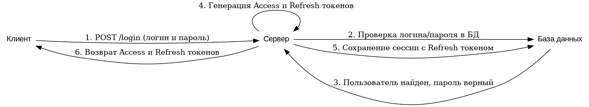
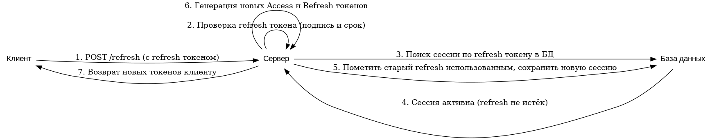

# Spring Security 6: JWT Access и Refresh токены

## 1. Введение: зачем нужны Access и Refresh токены

**JSON Web Token (JWT)** – это компактный URL-ориентированный формат для передачи удостоверяющей информации между сторонами в виде JSON объекта.  
JWT состоит из трех частей, разделенных точками: **Header** (заголовок), **Payload** (полезная нагрузка) и **Signature** (подпись).  
Заголовок обычно содержит алгоритм подписи (например, HS256) и тип токена.  
Payload содержит claims – произвольные данные о пользователе или иных фактах (например, идентификатор пользователя, роли, время выдачи токена).  
Подпись нужна для проверки целостности токена: сервер с помощью секретного ключа (или пары ключей)
подписывает токен и затем может убедиться, что токен не был подделан.

**JWT или Сессионные токены**  
В традиционных схемах аутентификации сервер хранит сессии (в памяти или БД) и выдаёт клиенту идентификатор сессии
(cookie с JSESSIONID). При каждом запросе сервер ищет сессию по этому ID.  
JWT же являются самодостаточными (stateless): вся необходимая информация уже внутри токена, и серверу не нужно хранить сессии для каждого пользователя.  
Достаточно проверить подпись JWT и считать из него данные - это снижает нагрузку на сервер и упрощает масштабирование,
так как нет центрального хранилища сессий.  
Кроме того, JWT легко передается в HTTP-заголовках (Authorization: Bearer <token>).  
Однако у JWT есть и минусы - например, после выдачи JWT невозможно отозвать или изменить его содержимое
до истечения срока, если не хранить дополнительное состояние на сервере. Поэтому срок жизни JWT обычно делают коротким.

В простейшем подходе можно использовать один JWT-токен, но разделение на Access-токен и Refresh-токен
значительно повышает безопасность и удобство работы:
* **Access-токен** (токен доступа) – краткоживущий токен, который добавляется к каждому запросу для доступа к защищенным ресурсам.
  Он обычно имеет небольшой срок жизни (5–15 минут). Благодаря короткому сроку действия, если Access-токен будет
  скомпрометирован, вред будет ограничен временными рамками его жизни.
* **Refresh-токен** (токен обновления) – токен с более длительным сроком жизни (несколько дней или недель), используемый
  исключительно для получения новых Access-токенов без повторного ввода логина и пароля. Refresh-токен не передается
  в каждом запросе, а хранится более безопасно (например, в HttpOnly cookie или защищенном хранилище приложения).

**Почему не использовать только один JWT?**  
Если делать Access-токен долгоживущим, повышается риск: при компрометации этого токена злоумышленник будет иметь длительный доступ.
Делать токен очень короткоживущим – неудобно для пользователя, пришлось бы часто логиниться заново.

**Как выдавать и хранить Refresh Token**  
В веб-приложениях refresh-токен обычно возвращается в HttpOnly Cookie, чтобы он автоматически отправлялся браузером
при обращении к серверу, но был недоступен на уровне JavaScript (что усложняет XSS-атаки).  
Однако в нашем примере будет использоваться curl/Postman, а не браузерный клиент. Эти инструменты не хранят
и не отправляют HttpOnly cookies автоматически так, как браузер, и им сложнее извлечь cookie из ответа.  
Поэтому для упрощения мы можем отдавать refresh-токен клиенту в теле ответа (в JSON вместе с access-токеном).  
Это допустимо в учебном приложении, но важно отметить: в production-системе безопаснее хранить refresh-токен в HttpOnly
cookie, чтобы клиентская сторона не могла его читать и потенциально утечь.  
Для учебных целей далее мы будем возвращать оба токена в теле JSON-ответа, а при обращении за обновлением токена - передавать refresh-токен в JSON запросе.

**Хранение refresh-токенов на сервере**  
Хотя JWT access-токены не требуют хранения на сервере, refresh-токены зачастую хранятся в базе данных на сервере.  
Это позволяет реализовать дополнительные меры безопасности: можно отозвать refresh-токен до истечения
(например, при выходе пользователя из системы), а главное - предотвратить повторное использование refresh-токена.  
Если не хранить refresh-токены, украденный refresh-токен мог бы использоваться неограниченно(пока не истечет), и сервер бы об этом не узнал.   
Сохраняя записи о выданных refresh-токенах, сервер может при попытке его использования проверить: действителен ли он,
не использован ли уже, не отозван ли администратором и т.д.  
Мы реализуем такой подход: при логине/регистрации сохраняем refresh-токен в таблице user_sessions базы данных.
При повторном использовании (refresh) старый токен помечается как использованный, а новый токен сохраняется как новая сессия.
Таким образом, один и тот же refresh-токен нельзя применить дважды – это предотвращает Replay-атаки с повторным использованием токена.

## 2. Общая схема JWT-авторизации (логин и обновление токенов)

JWT-авторизация в нашем приложении работает по следующей общей схеме: при аутентификации (логин или регистрация нового
пользователя) сервер проверяет учетные данные и выдает пару токенов.  
Access-токен используется сразу для доступа к API, а refresh-токен сохраняется для получения нового access-токена, когда старый истечет.  
Сервер хранит сведения о выданном refresh-токене (сессию)в базе данных.  
Далее, клиент прикрепляет access-токен к каждому запросу к защищенным ресурсам.  
Когда срок действия access-токена истекает, клиент обращается к специальному endpoint обновления, передавая refresh-токен,
а сервер проверяет его и если он действителен, выдает новую пару токенов (при этом старый refresh-токен помечается как использованный и более непригоден).

### 2.1. Процесс выдачи токенов при аутентификации (логин/регистрация)

При успешной аутентификации пользователя сервер генерирует JWT-токены и сохраняет информацию о refresh-токене.
Последовательность действий показана на диаграмме ниже.



1. Клиент выполняет запрос POST /login, передавая учетные данные пользователя (логин/пароль).
2. Сервер принимает запрос и проверяет полученные учетные данные - ищет пользователя в базе данных и сверяет хэш пароля.
3. База данных возвращает данные пользователя, подтверждая, что пользователь существует и пароль совпадает.
4. Сервер генерирует два JWT-токена: короткоживущий Access-токен и более долгоживущий Refresh-токен.
   Access-токен содержит нужные данные (идентификатор или email пользователя, роли и т.д.) и срок истечения ~15 мин.
   Refresh-токен содержит идентификатор сессии или другие метаданные и более длительный срок. Оба токена подписываются секретным ключом.
5. Сервер сохраняет информацию о выданных токенах в базе данных, создавая запись сессии.
   В таблицу сессий (user_sessions) заносится, как минимум: email пользователя, идентификатор устройства или сессии,
   значения refresh-токена и время его истечения, а также статус сессии (активна).
   Таким образом сервер помнит, какие refresh-токены выданы и не были использованы.
6. Сервер возвращает клиенту ответ, содержащий оба токена. В нашем случае это будет JSON с полями:
```json
{
  "accessToken": "<JWT_ACCESS_TOKEN>",
  "refreshToken": "<JWT_REFRESH_TOKEN>"
}
```
> В реальном приложении refresh-токен обычно помещается в HttpOnly Cookie, но для простоты учебного примера мы возвращаем его в теле ответа.

Access-токен клиент обычно сохраняет в памяти или другом безопасном месте, откуда сможет подставлять его в заголовки запросов.

После этого пользователь считается аутентифицированным. Клиент может вызывать защищенные ресурсы, передавая access-токен
в заголовке Authorization. Сервер при каждом таком запросе будет валидировать токен.

### 2.2. Процесс обновления токенов (Refresh токен)

Обновление токена происходит по запросу клиента, когда текущий access-токен больше недействителен.
Клиент делает запрос на специальный endpoint (например, /refresh) и предъявляет refresh-токен.
Сервер проверяет refresh-токен и, если все условия выполнены, выдает новую пару токенов, заменяя старые.
Важная часть процесса – обеспечение того, что один refresh-токен нельзя использовать более одного раза.
На диаграмме ниже показан успешный сценарий обновления:



1. Клиент выполняет запрос POST /refresh, передавая refresh-токен.
   Этот запрос не требует наличия активного access-токена, достаточно одного refresh-токена.
2. Сервер получает запрос и сначала проверяет валидность самого JWT refresh-токена:
   расшифровывает его с помощью того же секрета, проверяет корректность подписи и дату истечения (exp).
   Если токен невалидный (подпись не прошла проверку, токен просрочен, формат неверен),
   сервер сразу возвращает ошибку – процесс на этом заканчивается.
3. Если JWT валиден по подписи и времени, сервер обращается к базе данных и ищет запись сессии по значению refresh-токена.
4. База данных находит соответствующую запись сессии.
   Сервер проверяет поля: статус сессии должен быть ACTIVE (активна) и время жизни refresh-токена в записи не должно быть просрочено.
   Если запись не найдена, либо статус не активен (например, уже USED/REVOKED) или
   refreshTokenExpiry >= текущего времени - сервер отклонит запрос.
   В случае успеха - считаем, что refresh-токен еще действителен и не был использован ранее.
5. Сервер помечает старую сессию как использованную.
   В нашей реализации это означает обновить статус записи сессии: status = USED.
   Также можно сразу проставить время использования или иным образом зафиксировать, что данный refresh-токен более нельзя принимать.
   Важно: тут мы предотвращаем повторное применение того же токена.
   Если злоумышленник попытался бы одновременно использовать старый refresh, пока пользователь
   уже получил новый, то из-за этого флага статус будет не ACTIVE, и запрос будет отклонён.
   Кроме пометки старого, сервер создаёт новую запись сессии для нового refresh-токена.
   Эта новая запись будет иметь статус ACTIVE, новый refresh-токен, время истечения и deviceId (идентификатор устройства/клиента, если используется).
   Можно реализовать это либо созданием новой строки в таблице user_sessions, либо обновлением
   существующей записи с заменой токенов и сохранением.
   Мы выберем вариант создания новой записи, чтобы хранить историю.
6. Сервер генерирует новую пару JWT: свежий access-токен и refresh-токен, аналогично шагу 4 в процессе логина.
   При генерации можно привязать refresh-токен к новому deviceId или перенести существующий.
   Фактически, новый refresh-токен никак не совпадает со старым.
7. Сервер возвращает клиенту новую пару токенов (обычно в том же формате JSON с полями accessToken и refreshToken).
   Клиент получает их и заменяет у себя хранимые токены на новые.
   С этого момента следует использовать новый access-токен для дальнейших запросов.
   Процесс авторизации таким образом продлен без повторного ввода пароля.
   Старый refresh-токен теперь более не действителен - сервер пометил его использованным, и даже если кто-то попробует его снова отправить, сервер это обнаружит.

**Повторное использование refresh-токена (reuse detection)**  
Благодаря хранению статуса сессии, сервер может обнаружить попытку повторного использования refresh-токена.
Например, представим, что злоумышленник украл refresh-токен пользователя (но не успел использовать до того, как сам пользователь выполнил refresh).
При первой легитимной попытке обновления мы помечаем токен как USED и выдаем новый.
Если злоумышленник позже отправит старый refresh-токен, сервер найдёт в базе сессию со статусом USED.
Мы можем в этом случае определить, что токен пытаются использовать повторно, что вероятно является атакой.
Стратегии реагирования могут быть разные:
* Пометить такую сессию как REVOKED (отозванная) и отказать в обслуживании.
  Статус REVOKED может сигнализировать, что произошло нелегитимное повторное использование.
  Можно заблокировать все активные сессии пользователя и потребовать повторной аутентификации для безопасности.
* Удалить все refresh-сессии данного пользователя, тем самым потребовать у него войти заново.
* Логировать событие как попытку атаки и ничего не делать.

В нашем проекте мы вводим статус REVOKED для пометки сессий, токены которых были скомпрометированы или повторно отправлены.
Простое действие: если при попытке refresh обнаружено, что status = USED (т.е. токен уже был использован раньше),
мы обновим статус этой сессии на REVOKED и вернем ошибку.
Соответственно, все новые токены, которые могли быть выданы по ней, тоже стоит считать недействительными.
В реалистичном сценарии можно также сразу сделать logout пользователя на клиенте при таком событии и уведомить его.

## 3. Подключение необходимых библиотек

Чтобы работать с JWT в Java, мы воспользуемся библиотекой JJWT (Java JWT) от io.jsonwebtoken.
```xml
<dependency>
    <groupId>io.jsonwebtoken</groupId>
    <artifactId>jjwt-api</artifactId>
    <version>0.11.5</version>
</dependency>
<dependency>
    <groupId>io.jsonwebtoken</groupId>
    <artifactId>jjwt-impl</artifactId>
    <version>0.11.5</version>
    <scope>runtime</scope>
</dependency>
<dependency>
    <groupId>io.jsonwebtoken</groupId>
    <artifactId>jjwt-jackson</artifactId>
    <version>0.11.5</version>
    <scope>runtime</scope>
</dependency>
```
Первая зависимость предоставляет API JJWT, а две последующие - реализацию и интеграцию с Jackson для парсинга JSON.
Эти библиотеки позволят нам создавать и проверять JWT-токены.

## 4. Реализация
* **Генерация и валидация JWT.**  
  Создайте класс, который будет отвечать за создание JWT-токенов (и access, и refresh) и за проверку их валидности.
* **Фильтр проверки JWT.**  
  Создайте класс фильтра, который будет запускаться при каждом запросе и выполнять проверку JWT из заголовков.
* **Регистрация JWT-фильтра в конфигурации.**  
  При помощи SecurityFilterChain нужно настроить использование JWT-фильтра в цепочке безопасности.
* **Контроллер для аутентификации и обновления токенов.**  
  Создайте или модифицируйте существующий контроллер, который предоставит следующие методы:
    * **POST /api/auth/login** - вход пользователя, получение токенов.
    * **POST /api/auth/refresh** - запрос на обновление токенов (по refresh-токену).
* **Сущность UserSession и статус сессии SessionStatus.**
```java
@Entity
@Table(name = "user_sessions")
@Getter
@Setter
@NoArgsConstructor
@AllArgsConstructor
@Builder
public class UserSession {

    @Id
    @GeneratedValue(strategy = GenerationType.UUID)
    private UUID id;
    private String userEmail;// идентификатор пользователя
    private String deviceId;// идентификатор устройства или сессии, предоставленный клиентом
    @Column(length = 512)
    private String accessToken;// сам JWT access-токен (не обязательно хранить)
    @Column(length = 512)
    private String refreshToken;// JWT refresh-токен (нужен для поиска при refresh запросе)
    private Instant accessTokenExpiry;// время истечения access-токена
    private Instant refreshTokenExpiry;// время истечения refresh-токена
    @Enumerated(EnumType.STRING)
    private SessionStatus status;// статус сессии (ACTIVE, USED, REVOKED)
}
```
* **Репозиторий для работы с сессиями (UserSessionRepository).**
* **Выдача, обновление и отзыв токенов.**  
  Создайте сервис для работы с парами токенов, который будет содержать всю описанную логику работы с сессиями и токенами:
    * Создание новой сессии при логине/регистрации;
    * Обновление токенов по refresh-токену;
    * Инвалидция токенов, сессий и другие вспомогательные операции.
